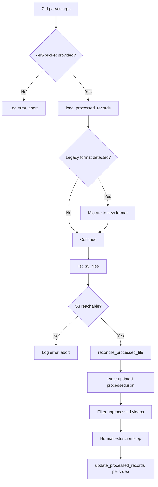

# Design Document: S3 Reconciliation

## Overview

This design adds two capabilities to `extract_transcripts.py`:

1. **Enhanced processed file format** — `processed.json` moves from a flat URL list (`{"processed_urls": [...]}`) to a richer record format (`{"processed": [{"url": "...", "filename": "video_id.md"}, ...]}`) with backward-compatible migration of the legacy format.

2. **S3 reconciliation** — Before each extraction run, the pipeline lists `.md` files in S3 and synchronizes `processed.json` against that listing. S3 is the source of truth. Files in S3 but not in `processed.json` get added (with empty URL). Records in `processed.json` with no corresponding S3 file get removed.

S3 is now mandatory. The pipeline aborts if `--s3-bucket` is not provided or if S3 is unreachable.

All changes are made in `extract_transcripts.py`. No new files are created.

## Architecture

The change is linear and contained within the existing script's startup path:



The reconciliation runs once at startup, before the extraction loop. The extraction loop itself is unchanged except it calls the renamed record-based functions.

## Components and Interfaces

### New Functions

#### `list_s3_files(s3_config: S3Config) -> Set[str]`

Lists all `.md` files under the configured prefix in S3, excluding `.md.metadata.json` files. Returns a set of basenames (e.g., `{"abc123.md", "def456.md"}`).

- Uses `list_objects_v2` with pagination (handles >1000 files)
- Creates boto3 session using `s3_config.aws_profile` if provided, otherwise default credential chain
- Raises an exception on any S3 error (network, permissions, etc.)

#### `reconcile_processed_file(processed_file_path: str, s3_config: S3Config) -> None`

Orchestrates the full reconciliation:

1. Calls `load_processed_records` to get current records
2. Calls `list_s3_files` to get S3 filenames
3. Computes diff:
   - **To add**: S3 filenames not in any record's `filename` field → create `Video_Record` with `url=""` and `filename=<basename>`
   - **To remove**: Records whose `filename` is not in S3 filenames set
4. Applies diff to the records list
5. Writes updated records to disk via `save_processed_records`
6. Logs counts of added/removed entries

#### `save_processed_records(filepath: str, records: list[dict]) -> None`

Writes the `{"processed": [records...]}` JSON to disk. Extracted as a helper so both `reconcile_processed_file` and `update_processed_records` can use it.

### Modified Functions

#### `load_processed_urls` → `load_processed_records(filepath: str) -> Tuple[Set[str], Set[str], list[dict]]`

Returns a tuple of `(url_set, filename_set, records_list)`.

- If file contains `"processed_urls"` key (legacy format): migrates each URL to a `Video_Record` by extracting the Video_ID. URLs where Video_ID extraction fails are logged and skipped. Writes the migrated format back to disk immediately.
- If file contains `"processed"` key (new format): loads directly.
- If file doesn't exist: returns empty sets and empty list.

#### `update_processed_urls` → `update_processed_records(filepath: str, video_url: str, video_id: str) -> None`

Appends a `{"url": video_url, "filename": "{video_id}.md"}` record. Rejects empty `video_url` (raises `ValueError`) since this function is only called during YouTube processing, not reconciliation.

#### `main()`

Modified startup sequence:

1. After parsing args, check that `s3_config` is not None. If None, log error and abort.
2. Call `load_processed_records` (handles migration if needed).
3. Call `reconcile_processed_file` (wrapped in try/except — any failure aborts the run).
4. Re-load records after reconciliation to get the updated state.
5. Filter unprocessed videos using both `url_set` and `filename_set` (a video is "processed" if its URL is in `url_set` OR its `{Video_ID}.md` is in `filename_set`).
6. Extraction loop calls `update_processed_records` instead of `update_processed_urls`.

#### CLI `__main__` block

The validation logic changes: instead of requiring "at least one storage destination," it now requires `--s3-bucket` to be provided. The `--no-local-save` flag remains valid (S3-only mode), but running without S3 is no longer allowed.

## Data Models

### Video_Record (JSON object)

```json
{
  "url": "https://www.youtube.com/watch?v=abc123",
  "filename": "abc123.md"
}
```

- `url`: string. Non-empty for YouTube-processed entries. Empty string `""` for S3-reconciled entries (files found in S3 without a known source URL).
- `filename`: string. Always `"{Video_ID}.md"`. Non-empty for all entries.

### New processed.json format

```json
{
  "processed": [
    {"url": "https://www.youtube.com/watch?v=abc123", "filename": "abc123.md"},
    {"url": "", "filename": "xyz789.md"}
  ]
}
```

### Legacy processed.json format (read-only, migrated on load)

```json
{
  "processed_urls": [
    "https://www.youtube.com/watch?v=abc123",
    "https://www.youtube.com/shorts/xyz789"
  ]
}
```

Migration extracts Video_ID from each URL using the existing regex `(?:v=|/)([a-zA-Z0-9_-]{11})(?:[&?]|$)` and produces `{"url": "<original_url>", "filename": "<video_id>.md"}`. URLs that fail Video_ID extraction are logged as warnings and dropped.


## Correctness Properties

*A property is a characteristic or behavior that should hold true across all valid executions of a system — essentially, a formal statement about what the system should do. Properties serve as the bridge between human-readable specifications and machine-verifiable correctness guarantees.*

### Property 1: Processed file round trip

*For any* valid list of Video_Record objects (each with a string `url` and string `filename`), writing them to a processed file via `save_processed_records` and reading them back via `load_processed_records` should produce an equivalent list of records.

**Validates: Requirements 1.1, 5.1**

### Property 2: Legacy migration preserves all valid URLs

*For any* list of valid YouTube URLs (each containing an extractable 11-character Video_ID), creating a legacy-format processed file (`{"processed_urls": [...]}`), loading it via `load_processed_records`, and inspecting the resulting records should yield one record per URL where `record.url` equals the original URL and `record.filename` equals `"{Video_ID}.md"`.

**Validates: Requirements 1.4, 5.2**

### Property 3: update_processed_records enforces non-empty URL and correct filename

*For any* non-empty YouTube URL string and valid video ID, calling `update_processed_records` should append a record with `url` equal to the provided URL and `filename` equal to `"{video_id}.md"`. *For any* empty string URL, calling `update_processed_records` should raise a `ValueError`.

**Validates: Requirements 1.2**

### Property 4: URL membership identifies processed videos

*For any* set of Video_Records loaded from a processed file, and *for any* video URL, the video is considered "already processed" if and only if the URL appears in at least one record's `url` field.

**Validates: Requirements 1.3, 4.1**

### Property 5: Filename membership identifies processed videos

*For any* set of Video_Records loaded from a processed file, and *for any* video with a known Video_ID, the video is considered "already processed" if any record's `filename` field equals `"{Video_ID}.md"`, even if that record's `url` is empty.

**Validates: Requirements 4.2**

### Property 6: S3 file listing returns only .md basenames

*For any* set of S3 object keys under a prefix, `list_s3_files` should return exactly the set of basenames that end with `.md` but do not end with `.md.metadata.json`.

**Validates: Requirements 2.1, 2.2**

### Property 7: Reconciliation aligns processed records with S3

*For any* set of existing Video_Records and *for any* set of S3 `.md` filenames, after reconciliation the resulting records' filename set should equal the S3 filename set. Records that existed before and are still in S3 should retain their original URL. Records added by reconciliation should have `url` equal to `""`.

**Validates: Requirements 2.3, 2.4**

## Error Handling

| Scenario | Behavior |
|---|---|
| `--s3-bucket` not provided | Log error, `sys.exit(1)` before any processing |
| S3 unreachable during `list_s3_files` (network error, permission denied, invalid bucket) | Log the boto3 exception, `sys.exit(1)` |
| Legacy URL fails Video_ID extraction during migration | Log warning with the URL, skip that entry, continue migrating remaining URLs |
| `processed.json` is corrupted JSON | Log warning, treat as empty (existing behavior preserved) |
| `processed.json` doesn't exist | Treat as empty, reconciliation will create it from S3 contents |
| `update_processed_records` called with empty URL | Raise `ValueError` — this is a programming error, not a runtime condition |
| S3 `list_objects_v2` returns truncated results | Paginate using `NextContinuationToken` until `IsTruncated` is false |

The key design choice: S3 errors are fatal (abort the run) because S3 is the source of truth. There's no point processing videos if we can't verify what's already in S3 or upload new results.

## Testing Strategy

### Property-Based Testing

Use `hypothesis` (Python's standard PBT library) for property-based tests. Each property test runs a minimum of 100 iterations.

All property tests go in `test_extract_transcripts.py` (or a new `test_s3_reconciliation.py` if preferred for isolation).

Each property test must be tagged with a comment referencing the design property:

```python
# Feature: s3-reconciliation, Property 1: Processed file round trip
```

Each correctness property (1–7) is implemented by a single `@given`-decorated test function.

Key generators needed:
- `video_record()`: generates `{"url": <youtube_url_or_empty>, "filename": "<11_char_id>.md"}`
- `youtube_url()`: generates valid YouTube watch/shorts URLs with 11-char video IDs
- `video_id()`: generates valid 11-character YouTube video ID strings (`[a-zA-Z0-9_-]{11}`)
- `s3_key_set()`: generates sets of S3 object keys mixing `.md` and `.md.metadata.json` files

For properties 6 and 7, mock `boto3` using `unittest.mock.patch` to simulate S3 responses without real AWS calls.

### Unit Tests

Unit tests complement property tests for specific examples and edge cases:

- **Legacy migration with invalid URLs**: a processed file containing `["not-a-youtube-url", "https://www.youtube.com/watch?v=abc12345678"]` — verify the invalid one is skipped and the valid one is migrated
- **Empty processed file**: verify `load_processed_records` returns empty sets
- **S3 abort on missing bucket arg**: verify the CLI exits with error when `--s3-bucket` is omitted
- **S3 abort on connection failure**: verify `reconcile_processed_file` propagates the exception
- **Reconciliation logging**: verify log output contains correct added/removed counts
- **Pagination**: verify `list_s3_files` handles multi-page S3 responses correctly

### Test Configuration

```
pytest test_s3_reconciliation.py -v
```

Dependencies to add to `requirements.txt`:
- `hypothesis` (for property-based testing)
- `pytest` (test runner, likely already present)
