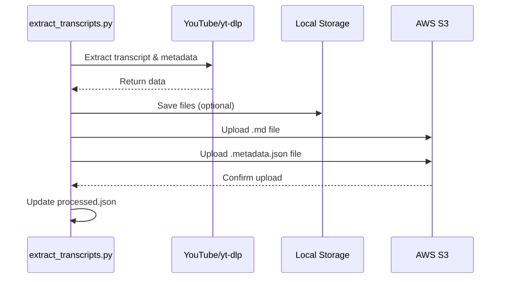

# Design Document: S3 Transcript Storage

## Overview

Add S3 storage capability to the YouTube transcript extraction system, enabling direct upload of transcript .md files and .metadata.json files to an S3 bucket instead of (or in addition to) local folder storage.

## Main Algorithm/Workflow



## Core Interfaces/Types

```python
from typing import Optional, Dict, Any
from dataclasses import dataclass

@dataclass
class S3Config:
    """Configuration for S3 storage"""
    bucket_name: str
    prefix: str = ""  # Optional S3 key prefix (folder path)
    region: str = "us-east-1"
    profile_name: Optional[str] = None  # AWS SSO profile name
    
@dataclass
class StorageConfig:
    """Configuration for storage destinations"""
    local_dir: Optional[str] = None  # None = skip local storage
    s3_config: Optional[S3Config] = None  # None = skip S3 storage
    
    def should_save_local(self) -> bool:
        return self.local_dir is not None
    
    def should_save_s3(self) -> bool:
        return self.s3_config is not None
```

## Key Functions with Formal Specifications

### Function 1: upload_to_s3()

def upload_to_s3(
    file_content: str,
    s3_key: str,
    bucket_name: str,
    content_type: str = "text/plain",
    metadata: Optional[Dict[str, str]] = None,
    profile_name: Optional[str] = None
) -> bool:
    """Upload file content to S3"""
    passpload file content to S3"""
    pass
```

**Preconditions:**
- `file_content` is non-empty string
- `s3_key` is valid S3 key (non-empty, no leading slash)
- `bucket_name` is valid S3 bucket name
- AWS credentials are configured (environment variables or IAM role)
- S3 bucket exists and is accessible

**Postconditions:**
- Returns `True` if upload successful
- Returns `False` if upload fails
- File exists in S3 at `s3://{bucket_name}/{s3_key}` on success
- No local side effects on failure

**Loop Invariants:** N/A (no loops)

### Function 2: save_transcript_with_storage()

```python
def save_transcript_with_storage(
    video_id: str,
    title: str,
    transcript: str,
    storage_config: StorageConfig
) -> None:
    """Save transcript to configured storage destinations"""
    pass
```

**Preconditions:**
- `video_id` is non-empty string (11-character YouTube ID)
- `title` is non-empty string
- `transcript` is non-empty string
- `storage_config` has at least one destination enabled (local or S3)

**Postconditions:**
- If `storage_config.should_save_local()`: file saved to local directory
- If `storage_config.should_save_s3()`: file uploaded to S3
- Raises `IOError` if all enabled storage operations fail
- At least one storage operation succeeds or exception raised

**Loop Invariants:** N/A

### Function 3: save_metadata_with_storage()

```python
def save_metadata_with_storage(
    video_id: str,
    metadata: Dict[str, Any],
    storage_config: StorageConfig
) -> None:
    """Save metadata to configured storage destinations"""
    pass
```

**Preconditions:**
- `video_id` is non-empty string (11-character YouTube ID)
- `metadata` contains all required fields (video_id, title, url, upload_date, playlists, transcript_language, processed_timestamp)
- `storage_config` has at least one destination enabled (local or S3)

**Postconditions:**
- If `storage_config.should_save_local()`: JSON file saved to local directory
- If `storage_config.should_save_s3()`: JSON file uploaded to S3
- Raises `IOError` if all enabled storage operations fail
- At least one storage operation succeeds or exception raised

**Loop Invariants:** N/A

## Algorithmic Pseudocode

### S3 Upload Algorithm

```python
def upload_to_s3(
    file_content: str,
    s3_key: str,
    bucket_name: str,
    content_type: str = "text/plain",
    metadata: Optional[Dict[str, str]] = None
) -> bool:
    """
    Upload file content directly to S3 without creating local temp file.
    
    INPUT: file_content (string), s3_key (string), bucket_name (string)
    OUTPUT: success (boolean)
    """
    # Step 1: Validate inputs
    if not file_content or not s3_key or not bucket_name:
        logger.error("Invalid input parameters for S3 upload")
    # Step 2: Initialize S3 client with optional profile
    try:
        import boto3
        if profile_name:
            session = boto3.Session(profile_name=profile_name)
            s3_client = session.client('s3')
        else:
            s3_client = boto3.client('s3')
    except ImportError:
        logger.error("boto3 not installed")
        return False
    except Exception as e:
        logger.error(f"Failed to initialize S3 client: {e}")
        return False as e:
        logger.error(f"Failed to initialize S3 client: {e}")
        return False
    
    # Step 3: Upload content to S3
    try:
        put_args = {
            'Bucket': bucket_name,
            'Key': s3_key,
            'Body': file_content.encode('utf-8'),
            'ContentType': content_type
        }
        
        if metadata:
            put_args['Metadata'] = metadata
        
        s3_client.put_object(**put_args)
        logger.info(f"Successfully uploaded to s3://{bucket_name}/{s3_key}")
        return True
        
    except Exception as e:
        logger.error(f"S3 upload failed for {s3_key}: {e}")
        return False
```

**Preconditions:**
- AWS credentials configured (via environment, config file, or IAM role)
- S3 bucket exists and caller has PutObject permission
- file_content is valid UTF-8 encodable string

**Postconditions:**
- Returns True if and only if object successfully stored in S3
- On success: object exists at s3://{bucket_name}/{s3_key}
- On failure: no partial uploads (S3 put_object is atomic)

### Unified Storage Save Algorithm

```python
def save_transcript_with_storage(
    video_id: str,
    title: str,
    transcript: str,
    storage_config: StorageConfig
) -> None:
    """
    Save transcript to all configured storage destinations.
    
    INPUT: video_id, title, transcript, storage_config
    OUTPUT: None (raises IOError on complete failure)
    """
    # Step 1: Format content
    content = f"# {title}\n\n{transcript}\n"
    filename = f"{video_id}.md"
    
    # Step 2: Track success for at least one destination
    any_success = False
    
    # Step 3: Save to local storage if configured
    if storage_config.should_save_local():
        try:
            filepath = os.path.join(storage_config.local_dir, filename)
            os.makedirs(storage_config.local_dir, exist_ok=True)
            
            with open(filepath, 'w', encoding='utf-8') as f:
                f.write(content)
            
    # Step 4: Upload to S3 if configured
    if storage_config.should_save_s3():
        s3_key = f"{storage_config.s3_config.prefix}{filename}".lstrip('/')
        
        success = upload_to_s3(
            file_content=content,
            s3_key=s3_key,
            bucket_name=storage_config.s3_config.bucket_name,
            content_type="text/markdown",
            profile_name=storage_config.s3_config.profile_name
        )
        
        if success:
            any_success = True
            bucket_name=storage_config.s3_config.bucket_name,
            content_type="text/markdown"
        )
        
        if success:
            any_success = True
    
    # Step 5: Ensure at least one destination succeeded
    if not any_success:
        raise IOError(f"Failed to save transcript {video_id} to any destination")
```

**Preconditions:**
- video_id is valid YouTube ID (11 characters)
- title and transcript are non-empty strings
- At least one storage destination is configured

**Postconditions:**
- At least one storage operation succeeds OR IOError raised
- If local enabled and succeeds: file exists at local path
- If S3 enabled and succeeds: file exists in S3 bucket
- No partial state: either operation completes or logs error

**Loop Invariants:** N/A

### Metadata Storage Algorithm

```python
def save_metadata_with_storage(
    video_id: str,
    metadata: Dict[str, Any],
    storage_config: StorageConfig
) -> None:
    """
    Save metadata JSON to all configured storage destinations.
    
    INPUT: video_id, metadata dict, storage_config
    OUTPUT: None (raises IOError on complete failure)
    """
    # Step 1: Serialize metadata to JSON
    filename = f"{video_id}.md.metadata.json"
    content = json.dumps(metadata, indent=2, ensure_ascii=False)
    
    # Step 2: Track success for at least one destination
    any_success = False
    
    # Step 3: Save to local storage if configured
    if storage_config.should_save_local():
        try:
            filepath = os.path.join(storage_config.local_dir, filename)
            os.makedirs(storage_config.local_dir, exist_ok=True)
            
            with open(filepath, 'w', encoding='utf-8') as f:
                f.write(content)
    # Step 4: Upload to S3 if configured
    if storage_config.should_save_s3():
        s3_key = f"{storage_config.s3_config.prefix}{filename}".lstrip('/')
        
        success = upload_to_s3(
            file_content=content,
            s3_key=s3_key,
            bucket_name=storage_config.s3_config.bucket_name,
            content_type="application/json",
            profile_name=storage_config.s3_config.profile_name
        )
        
        if success:
            any_success = Truent,
            s3_key=s3_key,
            bucket_name=storage_config.s3_config.bucket_name,
            content_type="application/json"
        )
        
        if success:
            any_success = True
    
    # Step 5: Ensure at least one destination succeeded
    if not any_success:
        raise IOError(f"Failed to save metadata {video_id} to any destination")
```

**Preconditions:**
- video_id is valid YouTube ID
- metadata contains all required fields
- At least one storage destination is configured

**Postconditions:**
- At least one storage operation succeeds OR IOError raised
- If local enabled and succeeds: JSON file exists at local path
# Example 1: S3-only storage (no local files) with AWS SSO profile
s3_config = S3Config(
    bucket_name="my-transcripts-bucket",
    prefix="youtube/transcripts/",
    region="us-east-1",
    profile_name="my-sso-profile"
)# Example Usage

```python
# Example 1: S3-only storage (no local files)
s3_config = S3Config(
    bucket_name="my-transcripts-bucket",
    prefix="youtube/transcripts/",
    region="us-east-1"
)

storage_config = StorageConfig(
    local_dir=None,  # Skip local storage
    s3_config=s3_config
)

# Save transcript directly to S3
save_transcript_with_storage(
    video_id="dQw4w9WgXcQ",
    title="Example Video",
    transcript="This is the transcript text...",
    storage_config=storage_config
)

# Example 2: Dual storage (both local and S3)
storage_config = StorageConfig(
    local_dir="./transcripts",
    s3_config=S3Config(
        bucket_name="my-transcripts-bucket",
        prefix="youtube/"
    )
)

save_transcript_with_storage(
    video_id="dQw4w9WgXcQ",
    title="Example Video",
    transcript="This is the transcript text...",
    storage_config=storage_config
)

save_metadata_with_storage(
    video_id="dQw4w9WgXcQ",
    metadata={
        "video_id": "dQw4w9WgXcQ",
        "title": "Example Video",
# Example 3: Command-line usage with AWS SSO profile
# python extract_transcripts.py --s3-bucket my-bucket --s3-prefix youtube/transcripts/ --aws-profile my-sso-profile
# python extract_transcripts.py --s3-bucket my-bucket --no-local-save --aws-profile production
# python extract_transcripts.py --output-dir ./transcripts --s3-bucket my-bucket --aws-profile dev
        "processed_timestamp": "2024-01-01T00:00:00Z"
    },
    storage_config=storage_config
)

# Example 3: Command-line usage
# python extract_transcripts.py --s3-bucket my-bucket --s3-prefix youtube/transcripts/
# python extract_transcripts.py --s3-bucket my-bucket --no-local-save
# python extract_transcripts.py --output-dir ./transcripts --s3-bucket my-bucket
```

## Correctness Properties

```python
# Property 1: At least one storage destination must succeed
def test_storage_requires_success():
    """At least one storage operation must succeed or raise IOError"""
    for all video_id, title, transcript, storage_config:
        try:
            save_transcript_with_storage(video_id, title, transcript, storage_config)
            # If no exception, at least one destination succeeded
            assert (storage_config.should_save_local() or storage_config.should_save_s3())
        except IOError:
            # Exception only raised if ALL destinations failed
            pass

# Property 2: S3 keys must not have leading slashes
def test_s3_key_format():
    """S3 keys should not start with '/' for proper path handling"""
    for prefix, filename in all_combinations:
        s3_key = f"{prefix}{filename}".lstrip('/')
        assert not s3_key.startswith('/')

# Property 3: Content uploaded to S3 matches source content
def test_s3_content_integrity():
    """Content uploaded to S3 must match original content exactly"""
    for content, s3_key, bucket in all_uploads:
        if upload_to_s3(content, s3_key, bucket):
            downloaded = s3_client.get_object(Bucket=bucket, Key=s3_key)['Body'].read()
            assert downloaded.decode('utf-8') == content

# Property 4: Metadata JSON is valid after serialization
def test_metadata_json_validity():
    """Metadata must remain valid JSON after serialization"""
    for metadata in all_metadata:
        content = json.dumps(metadata, indent=2, ensure_ascii=False)
        parsed = json.loads(content)
        assert parsed == metadata
```
