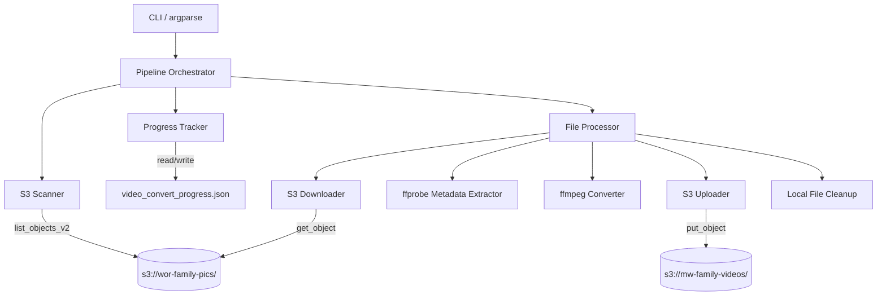
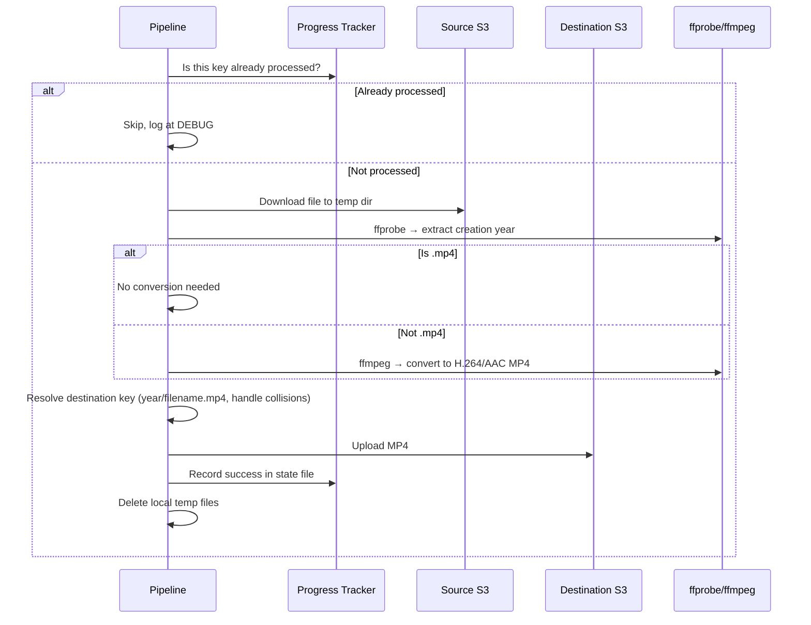

# Design Document: S3 Video Convert & Migrate

## Overview

A standalone Python CLI script (`s3_video_convert.py`) that scans the source S3 bucket (`s3://wor-family-pics/`), identifies video files, downloads them locally, converts non-MP4 videos to MP4 (H.264/AAC) via ffmpeg, and uploads the results to a destination bucket (`s3://mw-family-videos/`) organized by year. Progress is tracked in a local JSON state file to support resumption.

The script reuses patterns from `extract_transcripts.py` (S3 client initialization, paginated listing, state file I/O) but is a completely separate pipeline with no imports from the existing module.

### Key Design Decisions

- **Single file**: One script `s3_video_convert.py` keeps things simple. No package structure needed for a batch pipeline.
- **Sequential processing**: Files processed one at a time (download → convert → upload → cleanup) to bound local disk usage. The source bucket is ~576 GB; we can't pull it all down at once.
- **ffmpeg via subprocess**: No Python ffmpeg wrappers. Direct `subprocess.run` calls to `ffmpeg` and `ffprobe` — same pattern as `extract_transcripts.py` uses for `yt-dlp`.
- **State file per-pipeline**: Separate state file (`video_convert_progress.json`) from the existing `processed.json`. Different pipeline, different state.
- **No source bucket writes**: The S3 client for the source bucket is constructed with only read permissions conceptually enforced in code (only `list_objects_v2` and `get_object` calls).

## Architecture



### Processing Flow (per file)



## Components and Interfaces

### Module: `s3_video_convert.py`

Single-file module containing all components.

### Constants

```python
VIDEO_EXTENSIONS: set[str] = {
    '.mp4', '.mov', '.mts', '.m2ts', '.avi', '.wmv',
    '.mpg', '.mpeg', '.flv', '.mkv', '.3gp', '.webm', '.vob', '.ts'
}

SOURCE_BUCKET: str = "wor-family-pics"
DEST_BUCKET: str = "mw-family-videos"

METADATA_YEAR_FIELDS: list[str] = ["creation_time", "date", "encoded_date"]

DEFAULT_STATE_FILE: str = "video_convert_progress.json"
DEFAULT_TEMP_DIR: str = "video_convert_tmp"
```

### Functions

#### `parse_args() -> argparse.Namespace`
CLI argument parsing. Flags:
- `--dry-run`: Scan and report only, no downloads/conversions/uploads
- `--limit N`: Max number of files to process (applied to actual processing, not scanning)
- `--state-file PATH`: Override default state file path (default: `video_convert_progress.json`)
- `--temp-dir PATH`: Override default temp directory (default: `video_convert_tmp`)
- `--source-bucket NAME`: Override source bucket (default: `wor-family-pics`)
- `--dest-bucket NAME`: Override destination bucket (default: `mw-family-videos`)
- `--aws-profile NAME`: AWS SSO profile name (optional)
- `--verbose`: Set log level to DEBUG

#### `is_video_file(key: str) -> bool`
Returns `True` if the S3 key's extension (case-insensitive) is in `VIDEO_EXTENSIONS`.

#### `scan_source_bucket(s3_client, bucket: str) -> list[str]`
Paginated `list_objects_v2` over the entire source bucket. Returns list of S3 keys classified as video files. Logs skipped non-video files at DEBUG level. Logs total video count and skipped count at INFO.

#### `extract_year_from_metadata(local_path: str) -> str | None`
Runs `ffprobe -v quiet -print_format json -show_format <file>` and parses the JSON output. Checks `format.tags` for fields in `METADATA_YEAR_FIELDS` order. Extracts a 4-digit year via regex. Returns the year string or `None`.

#### `convert_to_mp4(input_path: str, output_path: str) -> bool`
Runs `ffmpeg -i <input> -c:v libx264 -c:a aac -movflags +faststart <output>`. Returns `True` on success (exit code 0), `False` on failure. Logs stderr on failure.

#### `resolve_dest_key(year: str | None, filename_stem: str, existing_dest_keys: set[str]) -> str`
Builds the destination key: `{year}/{stem}.mp4` or `unknown-year/{stem}.mp4`. If the key already exists in `existing_dest_keys`, appends `_1`, `_2`, etc. until unique. Logs a warning on collision.

#### `download_from_s3(s3_client, bucket: str, key: str, local_path: str) -> None`
Downloads an S3 object to a local file path using `s3_client.download_file()`.

#### `upload_to_s3(s3_client, bucket: str, key: str, local_path: str) -> None`
Uploads a local file to S3 using `s3_client.upload_file()`.

#### `load_progress(state_file: str) -> dict`
Loads the JSON state file. Returns the parsed dict, or an empty structure if the file doesn't exist.

#### `save_progress(state_file: str, progress: dict) -> None`
Writes the progress dict to the state file as JSON.

#### `process_file(source_key: str, s3_source, s3_dest, temp_dir: str, dest_bucket: str, existing_dest_keys: set[str]) -> dict | None`
Orchestrates single-file processing: download → probe → convert (if needed) → upload → cleanup. Returns a progress record dict on success, `None` on failure.

#### `run_pipeline(args: argparse.Namespace) -> None`
Main orchestrator. Scans, loads progress, filters already-processed keys, applies limit, iterates through files calling `process_file`, updates state after each success, logs running progress `[N/Total]`, logs final summary.

#### `main() -> None`
Entry point. Parses args, configures logging, calls `run_pipeline`.

## Data Models

### Progress State File (`video_convert_progress.json`)

```json
{
  "completed": [
    {
      "source_key": "Photos/2015/IMG_1234.MOV",
      "dest_key": "2015/IMG_1234.mp4",
      "timestamp": "2025-07-14T10:30:00Z"
    }
  ]
}
```

- `completed`: Array of records, one per successfully uploaded file.
- `source_key`: The original S3 key in the source bucket. Used as the dedup key.
- `dest_key`: The destination S3 key where the MP4 was uploaded.
- `timestamp`: ISO 8601 timestamp of when the upload completed.

The set of `source_key` values is used on startup to determine which files to skip.

### CLI Arguments (argparse Namespace)

| Argument | Type | Default | Description |
|---|---|---|---|
| `--dry-run` | flag | `False` | Preview mode, no side effects |
| `--limit` | int | `None` | Max files to process |
| `--state-file` | str | `video_convert_progress.json` | Path to state file |
| `--temp-dir` | str | `video_convert_tmp` | Local temp directory |
| `--source-bucket` | str | `wor-family-pics` | Source S3 bucket |
| `--dest-bucket` | str | `mw-family-videos` | Destination S3 bucket |
| `--aws-profile` | str | `None` | AWS profile name |
| `--verbose` | flag | `False` | DEBUG logging |

### ffprobe Output (parsed)

The `extract_year_from_metadata` function parses this structure from ffprobe JSON output:

```json
{
  "format": {
    "tags": {
      "creation_time": "2015-06-20T14:30:00.000000Z",
      "date": "2015",
      "encoded_date": "UTC 2015-06-20 14:30:00"
    }
  }
}
```

Year extraction: regex `r'\b(19|20)\d{2}\b'` applied to each field value in priority order.


## Correctness Properties

*A property is a characteristic or behavior that should hold true across all valid executions of a system — essentially, a formal statement about what the system should do. Properties serve as the bridge between human-readable specifications and machine-verifiable correctness guarantees.*

### Property 1: Video file classification is extension-based and case-insensitive

*For any* S3 key string, `is_video_file(key)` should return `True` if and only if the key's file extension, when lowercased, is a member of the `VIDEO_EXTENSIONS` set. Keys with no extension, or extensions not in the set, must return `False`. Case variations (`.MOV`, `.Mov`, `.mov`) must all classify identically.

**Validates: Requirements 1.2, 1.3**

### Property 2: MP4 files never trigger conversion

*For any* S3 key whose lowercased extension is `.mp4`, the pipeline's needs-conversion decision should return `False`. For any S3 key that is a video file but whose lowercased extension is not `.mp4`, the decision should return `True`.

**Validates: Requirements 2.2**

### Property 3: Destination key construction

*For any* year string (4-digit or `None`) and any filename stem, `resolve_dest_key` should produce a key of the form `{year}/{stem}.mp4` when a year is provided, or `unknown-year/{stem}.mp4` when year is `None`. The output filename must always use the original stem with a `.mp4` extension, regardless of the original extension.

**Validates: Requirements 2.5, 4.2, 4.3**

### Property 4: Metadata year extraction respects field priority

*For any* ffprobe metadata dict containing one or more of the fields `creation_time`, `date`, `encoded_date` with valid year values, `extract_year_from_metadata` should return the year from the highest-priority field present (priority order: `creation_time` > `date` > `encoded_date`). If a higher-priority field contains a valid year, lower-priority fields are ignored.

**Validates: Requirements 4.4**

### Property 5: Progress state round-trip

*For any* valid progress state (a dict with a `completed` list of records, each containing `source_key`, `dest_key`, and `timestamp` strings), saving the state with `save_progress` and then loading it with `load_progress` should produce an equivalent data structure.

**Validates: Requirements 6.1, 6.5**

### Property 6: Already-processed files are filtered out

*For any* set of completed source keys (from the progress state) and any list of scanned video keys, the set of keys selected for processing should equal the scanned keys minus the completed keys. No completed key should appear in the processing list, and no unprocessed key should be missing from it.

**Validates: Requirements 6.2**

### Property 7: Filename collision resolution produces unique keys

*For any* set of existing destination keys and any new base key that collides with one or more existing keys, `resolve_dest_key` should return a key that is not in the existing set. The returned key should have the form `{year}/{stem}_{n}.mp4` where `n` is the smallest positive integer that makes the key unique.

**Validates: Requirements 8.1**

### Property 8: Batch limit bounds actual processing count

*For any* list of unprocessed video keys and any positive integer limit N, the pipeline should process exactly `min(N, len(unprocessed))` files. Files that are skipped (already in progress state) do not count toward the limit. When limit is `None`, all unprocessed files are processed.

**Validates: Requirements 10.1, 10.2, 10.4**

## Error Handling

### ffmpeg/ffprobe Failures

- `convert_to_mp4` catches non-zero exit codes from ffmpeg. On failure: logs the error with the source S3 key and ffmpeg stderr, returns `False`, and the pipeline continues to the next file. The failed file is NOT recorded in the progress state, so it will be retried on the next run.
- `extract_year_from_metadata` catches ffprobe failures (non-zero exit, invalid JSON output). On failure: logs a warning and returns `None`, which causes the file to be placed in `unknown-year/`.

### S3 Failures

- Download failures (`download_from_s3`): Caught per-file. Logged with the source key. File skipped, not recorded in progress. Pipeline continues.
- Upload failures (`upload_to_s3`): Same handling. Local temp files are still cleaned up even on upload failure.
- Scan failures (`scan_source_bucket`): If the initial scan fails (e.g., permissions, network), the pipeline exits with a clear error message. No partial processing.

### State File Failures

- `load_progress`: If the file doesn't exist, returns empty state (all files unprocessed). If the file is corrupted JSON, logs a warning and returns empty state — this means files may be reprocessed, which is safe (idempotent uploads to S3).
- `save_progress`: If writing fails (disk full, permissions), the error propagates and the pipeline stops. This is intentional — we don't want to continue processing without being able to track progress.

### Local Disk Cleanup

- Temp files are cleaned up in a `finally` block within `process_file`, ensuring cleanup happens even on conversion or upload failure.
- If cleanup itself fails (e.g., file locked), a warning is logged but the pipeline continues.

### Summary Tracking

The pipeline maintains counters throughout execution:
- `files_converted`: Non-MP4 files successfully converted and uploaded
- `files_copied`: MP4 files successfully copied (uploaded without conversion)
- `files_skipped`: Files already in progress state
- `files_failed`: Files where download, conversion, or upload failed

These are logged in the final summary regardless of how the pipeline exits (completion, limit reached, or error).

## Testing Strategy

### Unit Tests

Unit tests cover specific examples and edge cases. Use `pytest`.

- `is_video_file`: Test with known video extensions, non-video extensions, no extension, mixed case, dotfiles, keys with multiple dots (e.g., `file.backup.mov`)
- `extract_year_from_metadata`: Test with mock ffprobe JSON output containing various field combinations, missing fields, malformed dates, years outside 1900-2099 range
- `resolve_dest_key`: Test basic path construction, collision with 1 existing key, collision with multiple existing keys, `None` year fallback
- `load_progress` / `save_progress`: Test with missing file, empty file, corrupted JSON, valid state
- `convert_to_mp4`: Test with mocked subprocess — verify correct ffmpeg arguments are constructed
- Edge cases: empty bucket scan (0 video files), all files already processed, limit of 0, filename with special characters, very long S3 keys

### Property-Based Tests

Use `hypothesis` (already in requirements.txt at version 6.151.9). Each property test runs a minimum of 100 iterations.

Each test is tagged with a comment referencing the design property:
- **Feature: s3-video-convert-migrate, Property 1: Video file classification is extension-based and case-insensitive**
- **Feature: s3-video-convert-migrate, Property 2: MP4 files never trigger conversion**
- **Feature: s3-video-convert-migrate, Property 3: Destination key construction**
- **Feature: s3-video-convert-migrate, Property 4: Metadata year extraction respects field priority**
- **Feature: s3-video-convert-migrate, Property 5: Progress state round-trip**
- **Feature: s3-video-convert-migrate, Property 6: Already-processed files are filtered out**
- **Feature: s3-video-convert-migrate, Property 7: Filename collision resolution produces unique keys**
- **Feature: s3-video-convert-migrate, Property 8: Batch limit bounds actual processing count**

### Hypothesis Generators

Custom strategies needed:
- `s3_keys()`: Generates random S3 key strings with path separators and various extensions
- `video_extensions()`: Samples from `VIDEO_EXTENSIONS` set
- `non_video_extensions()`: Generates extensions NOT in `VIDEO_EXTENSIONS`
- `year_strings()`: Generates 4-digit year strings in range 1900-2099, plus `None`
- `filename_stems()`: Generates valid filename stems (alphanumeric, underscores, hyphens)
- `progress_records()`: Generates valid progress state dicts with completed records
- `ffprobe_metadata()`: Generates mock ffprobe JSON output dicts with various tag combinations

### Test File

All tests in a single file: `test_s3_video_convert.py`, matching the existing test file naming convention in the project.
