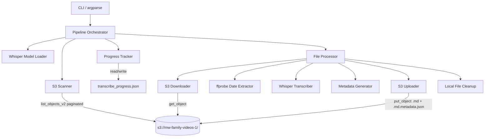
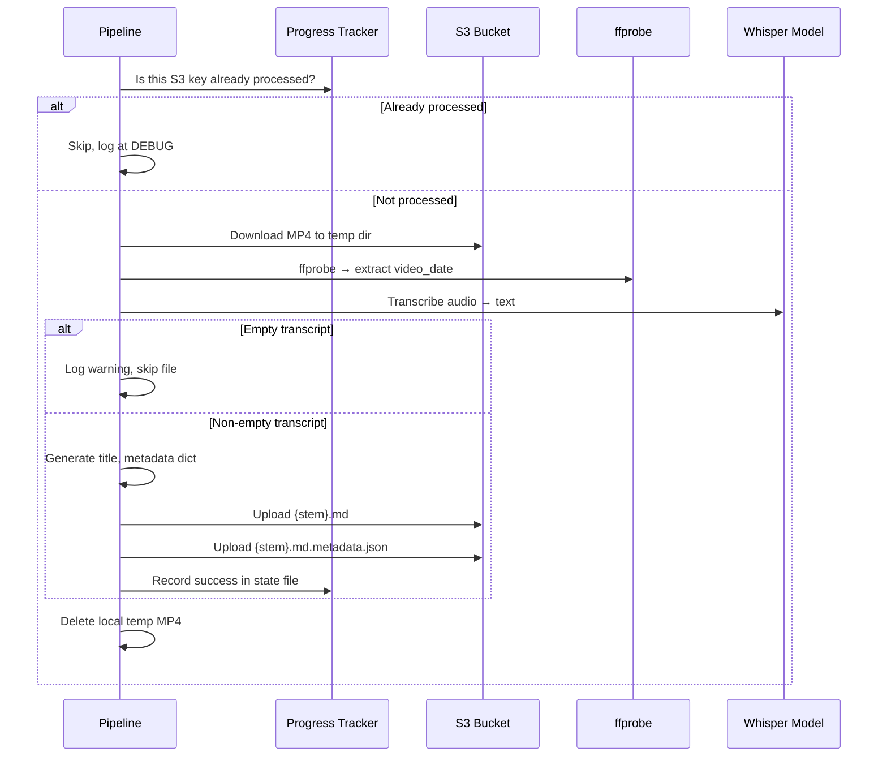

# Design Document: S3 Video Transcription

## Overview

A standalone Python CLI script (`s3_video_transcribe.py`) that scans the video bucket (`s3://mw-family-videos-1/`) for MP4 files, downloads each one locally, runs Whisper ("base" model) to generate a text transcript, produces a Bedrock Knowledge Base-compatible metadata JSON file, and uploads both the transcript (`.md`) and metadata (`.md.metadata.json`) back to the same S3 folder alongside the original MP4. Progress is tracked in a local JSON state file (`transcribe_progress.json`) to support resumption after interruption.

This is step 2 of the family video archive project. Step 1 (`s3_video_convert.py`) converted and migrated videos into the bucket. This script follows the same structural patterns — `parse_args`, `scan_source_bucket`, `download_from_s3`, `upload_to_s3`, `load_progress`, `save_progress`, `process_file`, `run_pipeline` — but is a completely separate pipeline with no imports from the existing modules.

### Key Design Decisions

- **Single file**: One script `s3_video_transcribe.py`. Same rationale as step 1 — no package structure needed for a batch pipeline.
- **Load Whisper model once**: The Whisper model is loaded once at pipeline start and passed into `process_file`. Loading the model is expensive (~seconds + GPU memory allocation), so we avoid reloading per file. This differs from `extract_transcripts.py` which loads the model inside each transcription call.
- **Same bucket for source and destination**: Unlike step 1 (which reads from one bucket and writes to another), this pipeline reads MP4s from and writes transcripts back to `s3://mw-family-videos-1/`. Transcript and metadata files are placed alongside the source MP4 in the same S3 prefix (folder).
- **State file is the only resumption mechanism**: The pipeline does NOT check S3 for existing `.md` files to determine what's already been transcribed. The local state file is the single source of truth for resumption. This keeps the scan fast and avoids extra S3 API calls.
- **ffprobe for video_date, S3 LastModified for upload_date**: Two different date sources for two different metadata fields. `video_date` comes from the video's embedded metadata (same ffprobe pattern as step 1). `upload_date` comes from the S3 object's `LastModified` timestamp captured during the scan phase.
- **Sequential processing**: Files processed one at a time (download → transcribe → upload transcript + metadata → cleanup) to bound local disk usage and GPU memory.
- **Title = humanized filename stem**: Underscores replaced with spaces. No other transformations (no title-casing, no date parsing from filenames).

## Architecture



### Processing Flow (per file)



## Components and Interfaces

### Module: `s3_video_transcribe.py`

Single-file module containing all components.

### Constants

```python
DEFAULT_BUCKET: str = "mw-family-videos-1"
METADATA_DATE_FIELDS: list[str] = ["creation_time", "date", "encoded_date"]
DEFAULT_STATE_FILE: str = "transcribe_progress.json"
DEFAULT_TEMP_DIR: str = "transcribe_tmp"
```

### Functions

#### `parse_args() -> argparse.Namespace`
CLI argument parsing. Flags:
- `--dry-run`: Scan and report only, no downloads/transcriptions/uploads
- `--limit N`: Max number of files to process (applied to actual processing, not scanning)
- `--verbose`: Set log level to DEBUG
- `--bucket NAME`: Override default bucket name (default: `mw-family-videos-1`)
- `--aws-profile NAME`: AWS SSO profile name (optional)
- `--state-file PATH`: Override default state file path (default: `transcribe_progress.json`)
- `--temp-dir PATH`: Override default temp directory (default: `transcribe_tmp`)

#### `humanize_title(filename_stem: str) -> str`
Replaces underscores with spaces in the filename stem. Returns the humanized string. No other transformations.

#### `scan_source_bucket(s3_client, bucket: str) -> list[dict]`
Paginated `list_objects_v2` over the entire bucket. Returns a list of dicts, each containing `{"key": str, "last_modified": datetime}` for objects with `.mp4` extension (case-insensitive). Captures `LastModified` from each S3 object during the scan. Logs total MP4 count and skipped count at INFO.

Note: Unlike step 1's scanner which returns just keys, this returns dicts because we need the `LastModified` timestamp for `upload_date` metadata.

#### `extract_video_date(local_path: str) -> str`
Runs `ffprobe -v quiet -print_format json -show_format <file>` and parses the JSON output. Checks `format.tags` for fields in `METADATA_DATE_FIELDS` order. Returns the full date string from the first field found, or an empty string if no valid date exists. Same pattern as step 1's `extract_year_from_metadata` but returns the full date string instead of just the year.

#### `transcribe_video(local_path: str, model) -> str`
Runs Whisper transcription on the local MP4 file using the pre-loaded model. Returns the transcript text string. The model parameter is the already-loaded Whisper model object. Returns an empty string if transcription produces no text.

#### `generate_metadata(s3_key: str, bucket: str, video_date: str, upload_date: str, transcript_language: str) -> dict`
Builds the Bedrock KB-compatible metadata dict. Derives `video_id` and `title` from the filename stem of the S3 key. Sets `url` to the full S3 URI. Sets `playlists` and `description` to empty strings. Sets `processed_timestamp` to current UTC time in ISO 8601. Wraps everything in `{"metadataAttributes": {...}}`.

Returns:
```python
{
    "metadataAttributes": {
        "video_id": str,       # filename stem
        "title": str,          # humanized filename stem
        "url": str,            # s3://bucket/key
        "video_date": str,     # from ffprobe or ""
        "upload_date": str,    # from S3 LastModified ISO 8601
        "playlists": str,      # ""
        "description": str,    # ""
        "transcript_language": str,  # "en"
        "processed_timestamp": str   # ISO 8601
    }
}
```

#### `download_from_s3(s3_client, bucket: str, key: str, local_path: str) -> None`
Downloads an S3 object to a local file path using `s3_client.download_file()`.

#### `upload_to_s3(s3_client, bucket: str, key: str, content: str, content_type: str) -> None`
Uploads string content to S3 using `s3_client.put_object()`. Encodes content as UTF-8 bytes.

Note: Unlike step 1 which uploads local files, this uploads string content directly since transcripts and metadata are generated in memory.

#### `load_progress(state_file: str) -> dict`
Loads the JSON state file. Returns the parsed dict, or `{"completed": []}` if the file doesn't exist or is corrupted.

#### `save_progress(state_file: str, progress: dict) -> None`
Writes the progress dict to the state file as JSON with 2-space indentation.

#### `process_file(s3_key: str, last_modified: datetime, s3_client, bucket: str, temp_dir: str, model) -> dict | None`
Orchestrates single-file processing: download → ffprobe date → transcribe → generate metadata → upload .md → upload .md.metadata.json → cleanup. Returns a progress record dict on success, `None` on failure. Cleans up local temp files in a `finally` block.

Parameters:
- `s3_key`: The S3 key of the MP4 file
- `last_modified`: The S3 object's LastModified timestamp (captured during scan)
- `s3_client`: boto3 S3 client
- `bucket`: Bucket name
- `temp_dir`: Local temp directory path
- `model`: Pre-loaded Whisper model object

Returns on success:
```python
{
    "source_key": "2015/VID_20150313_085854_924.mp4",
    "transcript_key": "2015/VID_20150313_085854_924.md",
    "metadata_key": "2015/VID_20150313_085854_924.md.metadata.json",
    "timestamp": "2026-07-14T10:30:00+00:00"
}
```

#### `run_pipeline(args: argparse.Namespace) -> None`
Main orchestrator. Loads Whisper model once (before the processing loop). Scans bucket, loads progress, filters already-processed keys, handles dry-run mode, applies limit, iterates through files calling `process_file`, updates state after each success, logs running progress `[N/Total]`, logs final summary (total found, transcribed, skipped, failed).

#### `main() -> None`
Entry point. Parses args, configures logging (including a dedicated file handler for `transcription_errors.log` that captures ERROR-level messages only), calls `run_pipeline`.

## Data Models

### Progress State File (`transcribe_progress.json`)

```json
{
  "completed": [
    {
      "source_key": "2015/VID_20150313_085854_924.mp4",
      "transcript_key": "2015/VID_20150313_085854_924.md",
      "metadata_key": "2015/VID_20150313_085854_924.md.metadata.json",
      "timestamp": "2026-07-14T10:30:00+00:00"
    }
  ]
}
```

- `completed`: Array of records, one per successfully uploaded transcript+metadata pair.
- `source_key`: The S3 key of the source MP4. Used as the dedup key for resumption.
- `transcript_key`: The S3 key where the `.md` file was uploaded.
- `metadata_key`: The S3 key where the `.md.metadata.json` file was uploaded.
- `timestamp`: ISO 8601 timestamp of when the upload completed.

The set of `source_key` values is loaded on startup to determine which files to skip.

### Metadata File (`{stem}.md.metadata.json`)

```json
{
  "metadataAttributes": {
    "video_id": "VID_20150313_085854_924",
    "title": "VID 20150313 085854 924",
    "url": "s3://mw-family-videos-1/2015/VID_20150313_085854_924.mp4",
    "video_date": "2015-03-13T08:58:54.000000Z",
    "upload_date": "2026-03-24T20:04:58+00:00",
    "playlists": "",
    "description": "",
    "transcript_language": "en",
    "processed_timestamp": "2026-07-14T10:30:00+00:00"
  }
}
```

All values are strings. No arrays, no nested objects inside `metadataAttributes`. This is a Bedrock KB constraint.

### Transcript File (`{stem}.md`)

```markdown
# VID 20150313 085854 924

This is the whisper-generated transcript text for the video...
```

Format: `# {title}\n\n{transcript}\n`

### CLI Arguments (argparse Namespace)

| Argument | Type | Default | Description |
|---|---|---|---|
| `--dry-run` | flag | `False` | Preview mode, no side effects |
| `--limit` | int | `None` | Max files to process |
| `--verbose` | flag | `False` | DEBUG logging |
| `--bucket` | str | `mw-family-videos-1` | S3 bucket name |
| `--aws-profile` | str | `None` | AWS profile name |
| `--state-file` | str | `transcribe_progress.json` | Path to state file |
| `--temp-dir` | str | `transcribe_tmp` | Local temp directory |

### ffprobe Output (parsed for video_date)

```json
{
  "format": {
    "tags": {
      "creation_time": "2015-03-13T08:58:54.000000Z",
      "date": "2015-03-13",
      "encoded_date": "UTC 2015-03-13 08:58:54"
    }
  }
}
```

Date extraction: returns the full value string from the first field found in priority order (`creation_time` > `date` > `encoded_date`). Unlike step 1 which extracts just the year, this returns the complete date string.


## Correctness Properties

*A property is a characteristic or behavior that should hold true across all valid executions of a system — essentially, a formal statement about what the system should do. Properties serve as the bridge between human-readable specifications and machine-verifiable correctness guarantees.*

### Property 1: MP4 extension classification is case-insensitive

*For any* S3 key string, the scanner should identify it as an MP4 candidate if and only if the key's file extension, when lowercased, is `.mp4`. Keys with extensions like `.MP4`, `.Mp4`, `.mp4` must all be accepted. Keys with no extension, or any other extension (`.mov`, `.txt`, `.md`, etc.), must be rejected.

**Validates: Requirements 1.2, 1.3**

### Property 2: Output key derivation from source key

*For any* S3 key ending in `.mp4` (e.g., `folder/subfolder/stem.mp4`), the derived transcript key should be `folder/subfolder/stem.md` and the derived metadata key should be `folder/subfolder/stem.md.metadata.json`. The folder prefix and filename stem must be preserved exactly; only the extension changes.

**Validates: Requirements 3.1, 4.1, 4.2**

### Property 3: Transcript file formatting

*For any* non-empty title string and non-empty transcript string, the formatted transcript content should exactly equal `# {title}\n\n{transcript}\n`. The output must start with `# `, followed by the title, two newlines, the transcript text, and a trailing newline.

**Validates: Requirements 2.3, 3.2**

### Property 4: Title humanization

*For any* filename stem string, `humanize_title` should return a string where every underscore is replaced with a space, and all other characters are unchanged. Applying `humanize_title` and then replacing spaces back with underscores should recover the original stem (for stems containing only underscores and non-space characters).

**Validates: Requirements 3.3, 4.6**

### Property 5: Metadata generation structure and content

*For any* valid S3 key, bucket name, video_date string, and upload_date string, `generate_metadata` should produce a dict with exactly one top-level key `metadataAttributes`, containing all required keys (`video_id`, `title`, `url`, `video_date`, `upload_date`, `playlists`, `description`, `transcript_language`, `processed_timestamp`). The `video_id` must equal the filename stem, `title` must equal the humanized stem, `url` must equal `s3://{bucket}/{key}`, and no value in `metadataAttributes` may be a list or dict.

**Validates: Requirements 4.3, 4.4, 4.5, 4.6, 4.7, 4.12, 6.2**

### Property 6: Date extraction respects field priority

*For any* ffprobe metadata dict containing one or more of the fields `creation_time`, `date`, `encoded_date` with non-empty string values, `extract_video_date` should return the value from the highest-priority field present (priority order: `creation_time` > `date` > `encoded_date`). If no fields are present, it should return an empty string.

**Validates: Requirements 5.2, 5.3, 5.4**

### Property 7: Progress state round-trip

*For any* valid progress state (a dict with a `completed` list of records, each containing `source_key`, `transcript_key`, `metadata_key`, and `timestamp` strings), saving the state with `save_progress` and then loading it with `load_progress` should produce an equivalent data structure.

**Validates: Requirements 7.1, 7.5**

### Property 8: Already-processed files are filtered out

*For any* set of completed source keys (from the progress state) and any list of scanned MP4 keys, the set of keys selected for processing should equal the scanned keys minus the completed keys. No completed key should appear in the processing list, and no unprocessed key should be missing from it.

**Validates: Requirements 7.2**

### Property 9: Batch limit bounds actual processing count

*For any* list of unprocessed MP4 keys and any positive integer limit N, the pipeline should process exactly `min(N, len(unprocessed))` files. When limit is `None`, all unprocessed files should be processed. Files that are skipped (already in progress state) do not count toward the limit.

**Validates: Requirements 8.1, 8.2, 8.4**

### Property 10: Failed files are never recorded as completed

*For any* file where `process_file` returns `None` (indicating failure), the file's source key must not appear in the progress state's completed records after the pipeline run. Only files where `process_file` returns a valid record dict are added to the completed list.

**Validates: Requirements 11.5**

## Error Handling

### Whisper Failures

- `transcribe_video` catches all exceptions from the Whisper model. On failure: logs the error with the S3 key, returns empty string, and `process_file` returns `None`. The failed file is NOT recorded in progress, so it will be retried on the next run.
- Empty transcript (Whisper returns no text): logged as a warning with the S3 key. File is skipped — no transcript or metadata uploaded, no progress record written.

### ffprobe Failures

- `extract_video_date` catches ffprobe failures (non-zero exit, invalid JSON output). On failure: logs a warning and returns an empty string for `video_date`. Processing continues — the file still gets transcribed, just with an empty `video_date` in metadata. This is not a fatal error.

### S3 Failures

- Download failures (`download_from_s3`): Caught per-file in `process_file`. Logged with the source key. File skipped, not recorded in progress. Pipeline continues to next file.
- Upload failures (`upload_to_s3`): Same handling. If either the transcript or metadata upload fails, the file is not recorded as completed. Local temp files are still cleaned up.
- Scan failures (`scan_source_bucket`): If the initial scan fails (permissions, network), the pipeline exits with a clear error. No partial processing occurs.

### State File Failures

- `load_progress`: If the file doesn't exist, returns empty state (all files unprocessed). If the file is corrupted JSON, logs a warning and returns empty state — files may be re-transcribed, which is safe (idempotent S3 uploads overwrite).
- `save_progress`: If writing fails (disk full, permissions), the error propagates and the pipeline stops. Intentional — we don't want to continue without tracking progress.

### Local Disk Cleanup

- Temp MP4 files are cleaned up in a `finally` block within `process_file`, ensuring cleanup happens even on transcription or upload failure.
- If cleanup itself fails (file locked, permissions), a warning is logged but the pipeline continues.

### Whisper Model Loading

- Model loading happens once at pipeline start in `run_pipeline`, before the processing loop. If model loading fails (e.g., out of memory, missing dependencies), the pipeline exits immediately with a clear error. No files are processed.

## Testing Strategy

### Unit Tests

Unit tests cover specific examples and edge cases. Use `pytest`.

- `humanize_title`: Test with underscores, no underscores, multiple consecutive underscores, empty string
- `extract_video_date`: Test with mock ffprobe JSON containing various field combinations, missing fields, empty tags dict, ffprobe returning invalid JSON
- `generate_metadata`: Test with a known S3 key and verify all fields are correct, verify `metadataAttributes` wrapper, verify no arrays in output
- `load_progress` / `save_progress`: Test with missing file, empty file, corrupted JSON, valid state
- Key derivation: Test transcript key and metadata key derivation from various S3 key patterns (nested folders, root-level files, special characters in filenames)
- Dry-run mode: Verify no downloads/transcriptions/uploads occur (mock S3 client, assert no calls)
- Empty transcript handling: Verify `process_file` returns `None` and no uploads occur
- CLI defaults: Verify `parse_args` produces correct default values for all flags
- Edge cases: empty bucket scan (0 MP4 files), all files already processed, limit of 0, filename with spaces/special characters

### Property-Based Tests

Use `hypothesis` (already in requirements.txt at version 6.151.9). Each property test runs a minimum of 100 iterations.

Each test is tagged with a comment referencing the design property:
- **Feature: s3-video-transcription, Property 1: MP4 extension classification is case-insensitive**
- **Feature: s3-video-transcription, Property 2: Output key derivation from source key**
- **Feature: s3-video-transcription, Property 3: Transcript file formatting**
- **Feature: s3-video-transcription, Property 4: Title humanization**
- **Feature: s3-video-transcription, Property 5: Metadata generation structure and content**
- **Feature: s3-video-transcription, Property 6: Date extraction respects field priority**
- **Feature: s3-video-transcription, Property 7: Progress state round-trip**
- **Feature: s3-video-transcription, Property 8: Already-processed files are filtered out**
- **Feature: s3-video-transcription, Property 9: Batch limit bounds actual processing count**
- **Feature: s3-video-transcription, Property 10: Failed files are never recorded as completed**

### Hypothesis Generators

Custom strategies needed:
- `s3_mp4_keys()`: Generates random S3 key strings ending in `.mp4` with optional folder prefixes (e.g., `2015/VID_something.mp4`, `unknown-year/clip.mp4`)
- `filename_stems()`: Generates valid filename stems (alphanumeric, underscores, hyphens — no dots or slashes)
- `s3_keys_with_extensions()`: Generates S3 keys with various extensions (`.mp4`, `.mov`, `.txt`, `.md`, etc.) for testing the MP4 filter
- `ffprobe_metadata()`: Generates mock ffprobe tag dicts with random subsets of `creation_time`, `date`, `encoded_date` fields containing date-like strings
- `progress_records()`: Generates valid progress state dicts with completed records containing `source_key`, `transcript_key`, `metadata_key`, `timestamp`
- `non_empty_text()`: Generates non-empty strings for transcript text and titles

### Test File

All tests in a single file: `test_s3_video_transcribe.py`, matching the existing test file naming convention in the project.
