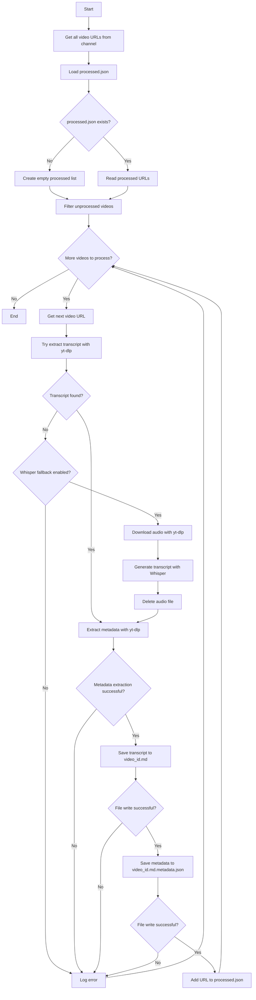

# Design Document: YouTube Transcript Extractor

## Overview

The YouTube Transcript Extractor is a Python script that extracts transcripts and metadata from all videos in the @MachiningCloud YouTube channel using yt-dlp. The system is designed for incremental processing, tracking successfully processed videos to avoid redundant work.

The extractor operates in a Windows environment with bash shell and follows a simple, straightforward implementation approach. It produces markdown transcript files and JSON metadata files with AWS Bedrock-compatible naming conventions.

### Key Design Goals

- Simple, single-script implementation using yt-dlp for all YouTube operations
- Incremental processing with persistent state tracking
- Graceful error handling that doesn't block processing of other videos
- AWS Bedrock-compatible metadata file naming

## Architecture

### System Components

The system consists of a single Python script (`extract_transcripts.py`) that orchestrates the following operations:

1. **Channel URL Discovery**: Uses yt-dlp to fetch all video URLs from the @MachiningCloud channel
2. **State Management**: Reads and updates `processed.json` to track completed extractions
3. **Transcript Extraction**: Uses yt-dlp to extract video transcripts
4. **Metadata Extraction**: Uses yt-dlp to extract video metadata
5. **File Writing**: Saves transcripts and metadata to disk with specific naming conventions
6. **Error Handling**: Logs errors and continues processing without corrupting state

### Execution Flow



### Technology Stack

- **Python 3.x**: Primary implementation language
- **yt-dlp**: YouTube data extraction library
- **OpenAI Whisper**: Speech-to-text model for generating transcripts when YouTube transcripts are unavailable
- **JSON**: State tracking and metadata storage format
- **Markdown**: Transcript output format

## Components and Interfaces

### Main Script: extract_transcripts.py

The main script contains the following functions:

#### get_channel_videos(channel_url: str) -> List[str]
```python
def get_channel_videos(channel_url: str) -> List[str]:
    """
    Fetches all video URLs from a YouTube channel using yt-dlp.
    
    Args:
        channel_url: The YouTube channel URL (e.g., '@MachiningCloud')
    
    Returns:
        List of video URLs
    
    Raises:
        Exception: If yt-dlp fails to fetch channel data
    """
```

Uses yt-dlp with `--flat-playlist` and `--get-url` options to efficiently retrieve all video URLs without downloading content.

#### load_processed_urls(filepath: str) -> Set[str]
```python
def load_processed_urls(filepath: str) -> Set[str]:
    """
    Loads the set of already processed video URLs from processed.json.
    
    Args:
        filepath: Path to processed.json
    
    Returns:
        Set of processed URLs (empty set if file doesn't exist)
    """
```

Reads `processed.json` and returns a set for O(1) lookup performance. Creates an empty set if the file doesn't exist.

#### extract_transcript(video_url: str, use_whisper_fallback: bool = False) -> Tuple[str, str, str]
```python
def extract_transcript(video_url: str, use_whisper_fallback: bool = False) -> Tuple[str, str, str]:
    """
    Extracts transcript from a YouTube video using yt-dlp.
    Falls back to Whisper speech-to-text if YouTube transcript is unavailable.
    
    Args:
        video_url: The YouTube video URL
        use_whisper_fallback: Whether to use Whisper if YouTube transcript unavailable
    
    Returns:
        Tuple of (video_id, transcript_text, language_code)
    
    Raises:
        Exception: If transcript extraction fails
    """
```

Uses yt-dlp with `--write-auto-sub` or `--write-sub` to extract transcripts. Prefers manual transcripts over auto-generated ones.

If `use_whisper_fallback` is True and no YouTube transcript is available:
1. Downloads audio using yt-dlp with `--extract-audio` and `--audio-format mp3`
2. Loads Whisper model (base model by default for balance of speed/accuracy)
3. Transcribes audio using Whisper
4. Deletes downloaded audio file to save disk space
5. Returns generated transcript

#### extract_metadata(video_url: str) -> dict
```python
def extract_metadata(video_url: str) -> dict:
    """
    Extracts metadata from a YouTube video using yt-dlp.
    
    Args:
        video_url: The YouTube video URL
    
    Returns:
        Dictionary containing video metadata
    
    Raises:
        Exception: If metadata extraction fails
    """
```

Uses yt-dlp with `--dump-json` to extract video metadata including title, upload date, playlists, etc.

#### save_transcript(video_id: str, transcript: str, output_dir: str) -> None
```python
def save_transcript(video_id: str, transcript: str, output_dir: str) -> None:
    """
    Saves transcript to a markdown file.
    
    Args:
        video_id: YouTube video ID
        transcript: Transcript text
        output_dir: Directory to save the file
    
    Raises:
        IOError: If file writing fails
    """
```

Writes transcript to `{video_id}.md` in the specified output directory.

#### save_metadata(video_id: str, metadata: dict, output_dir: str) -> None
```python
def save_metadata(video_id: str, metadata: dict, output_dir: str) -> None:
    """
    Saves metadata to a JSON file with AWS Bedrock naming convention.
    
    Args:
        video_id: YouTube video ID
        metadata: Metadata dictionary
        output_dir: Directory to save the file
    
    Raises:
        IOError: If file writing fails
    """
```

Writes metadata to `{video_id}.md.metadata.json` following AWS Bedrock naming requirements.

#### update_processed_urls(filepath: str, video_url: str) -> None
```python
def update_processed_urls(filepath: str, video_url: str) -> None:
    """
    Adds a successfully processed video URL to processed.json.
    
    Args:
        filepath: Path to processed.json
        video_url: The video URL to add
    
    Raises:
        IOError: If file writing fails
    """
```

Appends the video URL to `processed.json`. Creates the file if it doesn't exist.

#### main() -> None
```python
def main() -> None:
    """
    Main execution function that orchestrates the extraction process.
    """
```

Coordinates all operations: fetching URLs, filtering, extracting, saving, and updating state.

## Data Models

### processed.json Structure

```json
{
  "processed_urls": [
    "https://www.youtube.com/watch?v=VIDEO_ID_1",
    "https://www.youtube.com/watch?v=VIDEO_ID_2"
  ]
}
```

A simple JSON object containing an array of successfully processed video URLs.

### Metadata JSON Structure

```json
{
  "video_id": "VIDEO_ID",
  "title": "Video Title",
  "url": "https://www.youtube.com/watch?v=VIDEO_ID",
  "upload_date": "20240115",
  "playlists": ["Playlist Name 1", "Playlist Name 2"],
  "transcript_language": "en",
  "processed_timestamp": "2024-01-15T10:30:00Z"
}
```

Metadata file follows AWS Bedrock naming convention (`{video_id}.md.metadata.json`) and contains all required fields.

### Transcript Markdown Structure

```markdown
# Video Title

[Transcript text content]
```

Simple markdown format with the video title as a header followed by the transcript text.


## Correctness Properties

A property is a characteristic or behavior that should hold true across all valid executions of a system—essentially, a formal statement about what the system should do. Properties serve as the bridge between human-readable specifications and machine-verifiable correctness guarantees.

### Property 1: URL Filtering Set Difference

For any set of all video URLs and any set of processed URLs, the filtered list of unprocessed URLs should equal the set difference (all URLs minus processed URLs).

**Validates: Requirements 2.2**

### Property 2: Transcript Filename Convention

For any video ID, when saving a transcript, the filename should follow the pattern `{video_id}.md`.

**Validates: Requirements 3.2**

### Property 3: Metadata Filename Convention

For any video ID, when saving metadata, the filename should follow the pattern `{video_id}.md.metadata.json`.

**Validates: Requirements 4.2**

### Property 4: Metadata Completeness

For any metadata file created, it should contain all required fields: video_id, title, url, upload_date, playlists (as an array), transcript_language, and processed_timestamp.

**Validates: Requirements 4.3, 4.4, 4.5, 4.6, 4.7, 4.8, 4.9**

### Property 5: State Consistency on Failure

For any extraction failure (transcript extraction, metadata extraction, or file writing), the video URL should not be added to processed.json.

**Validates: Requirements 5.1, 5.2, 5.3**

### Property 6: Error Resilience

For any list of videos where some extractions fail, all videos in the list should be attempted (failures should not stop processing of remaining videos).

**Validates: Requirements 3.3, 5.5**

### Property 7: State Update on Success

For any video where both transcript and metadata are successfully extracted and saved, the video URL should be added to processed.json.

**Validates: Requirements 6.1**

### Property 8: Append Preserves Existing Entries

For any existing set of processed URLs in processed.json, adding a new URL should preserve all existing URLs (the new set should be the old set plus the new URL).

**Validates: Requirements 6.2**

## Error Handling

The system implements graceful error handling to ensure robustness and recoverability:

### Error Categories

1. **Channel Fetch Errors**: If yt-dlp cannot fetch the channel video list, the script logs the error and exits (no videos to process).

2. **Transcript Extraction Errors**: If a video's transcript cannot be extracted:
   - Log the error with video URL and error details
   - Skip to the next video without updating processed.json
   - Continue processing remaining videos

3. **Metadata Extraction Errors**: If a video's metadata cannot be extracted:
   - Log the error with video URL and error details
   - Skip to the next video without updating processed.json
   - Continue processing remaining videos

4. **File Writing Errors**: If transcript or metadata files cannot be written:
   - Log the error with video URL and error details
   - Skip to the next video without updating processed.json
   - Continue processing remaining videos

5. **State File Errors**: If processed.json cannot be read or written:
   - On read failure: treat as empty (all videos unprocessed)
   - On write failure: log error but continue (video can be retried next run)

### Error Logging

All errors are logged with the following information:
- Timestamp
- Video URL
- Error type (transcript extraction, metadata extraction, file writing, etc.)
- Error message/details from yt-dlp or Python exceptions

### Recovery Strategy

The system is designed for safe retry:
- Failed extractions are not marked as processed
- Next run will retry failed videos
- Successfully processed videos are never reprocessed
- No partial state updates (both transcript and metadata must succeed)

## Testing Strategy

The testing strategy employs both unit tests and property-based tests to ensure comprehensive coverage.

### Unit Testing

Unit tests focus on specific examples, edge cases, and integration points:

1. **File Operations**:
   - Test reading existing processed.json
   - Test creating new processed.json when it doesn't exist (Requirements 2.3)
   - Test appending to processed.json
   - Test handling corrupted processed.json

2. **Error Logging**:
   - Test that errors are logged with URL and details (Requirements 5.4)
   - Test log format and content

3. **Integration Points**:
   - Test yt-dlp command construction
   - Test parsing yt-dlp JSON output
   - Test file path construction

4. **Edge Cases**:
   - Empty channel (no videos)
   - All videos already processed
   - Missing transcript for a video
   - Invalid video URL

### Property-Based Testing

Property-based tests verify universal properties across many generated inputs. We will use the `hypothesis` library for Python, configured to run a minimum of 100 iterations per test.

Each property test references its corresponding design document property using the tag format:
**Feature: youtube-transcript-extractor, Property {number}: {property_text}**

1. **Property 1: URL Filtering Set Difference**
   - Generate random sets of all URLs and processed URLs
   - Verify filtered result equals set difference
   - Tag: **Feature: youtube-transcript-extractor, Property 1: URL Filtering Set Difference**

2. **Property 2: Transcript Filename Convention**
   - Generate random video IDs
   - Verify filename matches `{video_id}.md` pattern
   - Tag: **Feature: youtube-transcript-extractor, Property 2: Transcript Filename Convention**

3. **Property 3: Metadata Filename Convention**
   - Generate random video IDs
   - Verify filename matches `{video_id}.md.metadata.json` pattern
   - Tag: **Feature: youtube-transcript-extractor, Property 3: Metadata Filename Convention**

4. **Property 4: Metadata Completeness**
   - Generate random metadata dictionaries
   - Verify all required fields are present
   - Verify playlists is an array
   - Tag: **Feature: youtube-transcript-extractor, Property 4: Metadata Completeness**

5. **Property 5: State Consistency on Failure**
   - Simulate random extraction failures
   - Verify processed.json is not updated
   - Tag: **Feature: youtube-transcript-extractor, Property 5: State Consistency on Failure**

6. **Property 6: Error Resilience**
   - Generate random lists of videos with some failures
   - Verify all videos are attempted
   - Tag: **Feature: youtube-transcript-extractor, Property 6: Error Resilience**

7. **Property 7: State Update on Success**
   - Generate random successful extractions
   - Verify URL is added to processed.json
   - Tag: **Feature: youtube-transcript-extractor, Property 7: State Update on Success**

8. **Property 8: Append Preserves Existing Entries**
   - Generate random existing URL sets
   - Add new URL and verify old URLs remain
   - Tag: **Feature: youtube-transcript-extractor, Property 8: Append Preserves Existing Entries**

### Test Configuration

- Property-based tests: minimum 100 iterations per test
- Unit tests: standard pytest configuration
- Test data: use temporary directories for file operations
- Mocking: mock yt-dlp calls to avoid network dependencies in tests
